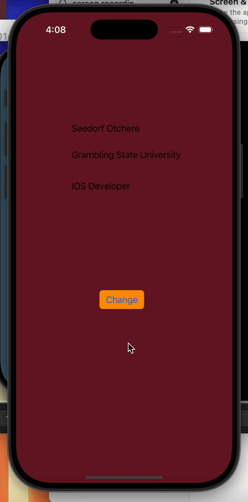

# Prework - *iOS101-Prework*

Submitted by: **Seedorf Otchere**

**iOS101-Prework** is an app that has labels about me and allows users to change the screen color to a random color

Time spent: **3** hours spent in total

## Required Features

The following **required** functionality is completed:

- [x] Users are see a screen with three labels and a button
- [x] Tapping the button changes the screen color to a random color
 
## Video Walkthrough

## App Brainstorming (Step 4)
*Netflix*
  - Changing App theme
  - Horizontal Scroll 
*SnapChat*
  - Logo Change  
  - App Widgets

## Notes

Describe any challenges encountered while building the app.

## License

    Copyright 2025 Seedorf Otchere

    Licensed under the Apache License, Version 2.0 (the "License");
    you may not use this file except in compliance with the License.
    You may obtain a copy of the License at

        http://www.apache.org/licenses/LICENSE-2.0

    Unless required by applicable law or agreed to in writing, software
    distributed under the License is distributed on an "AS IS" BASIS,
    WITHOUT WARRANTIES OR CONDITIONS OF ANY KIND, either express or implied.
    See the License for the specific language governing permissions and
    limitations under the License.
